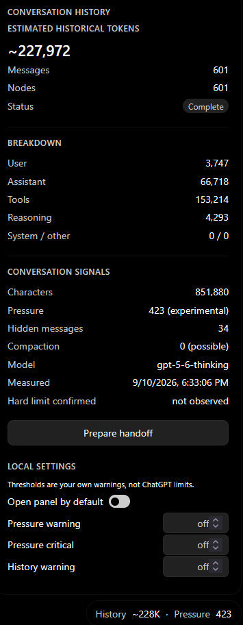

# Conversation Meter for ChatGPT

An unofficial browser extension that estimates the observable historical size of the current ChatGPT conversation and shows an experimental structural pressure signal.

[](https://github.com/jyu041/chatgpt-meter/actions/workflows/ci.yml)
[](https://github.com/jyu041/chatgpt-meter/releases)
[](LICENSE)
[](https://www.mozilla.org/firefox/)

**Unofficial third-party extension. Not affiliated with, endorsed by, or supported by OpenAI.**

<p align="center">
  
</p>

## Why

ChatGPT does not expose a clear conversation-lifespan meter. Long technical conversations can eventually reach a maximum conversation length, while an extension can only measure signals observable in the page and its authenticated conversation responses.

## Features

- Paginated historical conversation measurement
- Approximate historical token and character counts
- User, assistant, tools, reasoning, system, and other breakdowns
- Active conversation structure and hidden-message counts
- Experimental structural pressure and conservative compaction signals
- Bounded observation of visible maximum-conversation-length notices
- Optional local warning and critical thresholds
- Safe `Prepare handoff` action that never submits automatically
- Dark/light styling that follows ChatGPT
- Local-only settings and calibration observations
- No telemetry or analytics

## Install

### Firefox

The GitHub beta is unsigned and is not yet distributed through AMO. This is a temporary developer/test installation.

1. Open the [v0.1.0 GitHub release](https://github.com/jyu041/chatgpt-meter/releases/tag/v0.1.0).
2. Download `chatgpt-meter-0.1.0-firefox.zip` and extract it.
3. Open `about:debugging#/runtime/this-firefox` in Firefox.
4. Click **Load Temporary Add-on**.
5. Select the extracted extension's `manifest.json`.

Firefox removes temporary extensions when the browser exits. Persistent Firefox installation will come with AMO distribution and signing.

### Chrome / Chromium

1. Open the [v0.1.0 GitHub release](https://github.com/jyu041/chatgpt-meter/releases/tag/v0.1.0).
2. Download `chatgpt-meter-0.1.0-chrome.zip` and extract it.
3. Open `chrome://extensions`.
4. Enable **Developer mode**.
5. Click **Load unpacked**.
6. Select the extracted extension directory.

Chromium is build-tested but has received less authenticated live validation than Firefox.

## How to use

After opening a ChatGPT conversation, a compact meter appears in the bottom-right corner, such as `History ~228K · Pressure 423`. Click it to open the detail panel.

- `History` is an approximate measure of text represented by observable/retrievable conversation history.
- `Pressure` is an experimental raw structural conversation-lifespan signal.
- Neither is OpenAI's internal context-window percentage.
- Thresholds are optional local warnings that you define yourself.
- `Prepare handoff` places a structured handoff request in the ChatGPT composer; it never sends it.
- If the composer already contains an unrelated draft, the extension refuses to overwrite it.

## What the numbers mean

Historical tokens are not the model's current context-window usage. The extension cannot access OpenAI's internal context counter. Structural pressure is experimental and is not an OpenAI metric or a universal conversation limit.

Token estimates are deliberately approximate. Paginated message responses are treated as the endpoint's selected sequence; regenerated/edited version semantics remain uncertain.

## Privacy

Conversation data is processed locally in the ChatGPT page. The extension may make authenticated same-origin requests to ChatGPT to retrieve older pages of the current conversation. It uses no developer server, telemetry, or analytics, and sends no raw conversation content to the developer or a third-party service.

See [`PRIVACY.md`](PRIVACY.md) for the data policy and [`SECURITY.md`](SECURITY.md) for vulnerability reporting.

## Browser support

- Firefox 128+: primary target and authenticated release-tested browser
- Chromium: MV3 build-tested, with less authenticated live validation

## Known limitations

- ChatGPT's private endpoints and response formats may change without notice.
- Historical size is not current model context usage.
- Structural pressure has no universal denominator or threshold.
- A reopened conversation cannot prove a prior hard-limit UI event that is no longer visible.

## Development

Install Node.js 20 or newer, then install dependencies and run the checks:

```bash
npm ci
npm run check
```

Tests use synthetic fixtures only. Do not commit real conversations, credentials, cookies, or request captures.

## Building

```bash
npm run build:firefox
npm run build:chrome
npm run zip:firefox
npm run zip:chrome
```

See [`SOURCE_CODE_REVIEW.md`](SOURCE_CODE_REVIEW.md) for reproducible Firefox source-review instructions.

## License

MIT. See [`LICENSE`](LICENSE).

## Disclaimer

Unofficial third-party extension. Not affiliated with, endorsed by, or supported by OpenAI. ChatGPT and OpenAI are trademarks of their respective owners.
